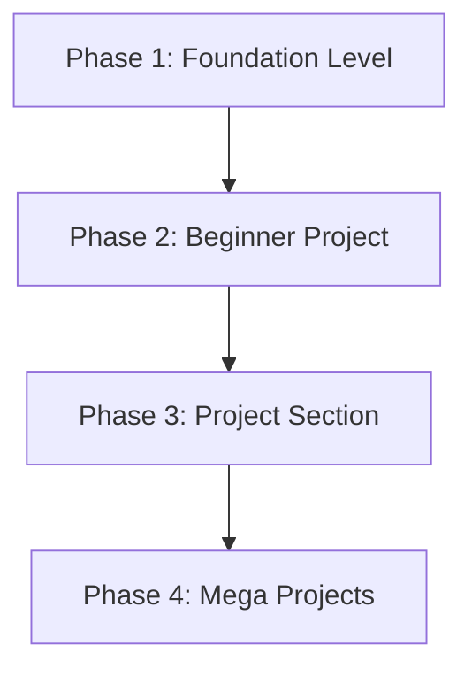

# <p align="center"><br>HTML Mastery with Nilansha</p>

<p align="center">
  <strong>From Absolute Beginner to Building Structured Websites with HTML</strong>
</p>

<p align="center">
  <a href="YOUR_GITHUB_PAGES_URL">
    
  </a>
  <a href="https://github.com/lucifer01430/html-mastery-with-nilansha/blob/main/LICENSE">
    
  </a>
  <a href="#contribution-section">
    
  </a>
</p>

<p align="center">
  A complete, open-source, beginner-friendly course structured to help you learn HTML from absolute scratch through structured lessons, practical examples, exercises, and real-world projects.
</p>

---

## 📖 About The Course

**HTML Mastery with Nilansha** is a free, open-source educational program designed to build a rock-solid foundation in web development. 

While many tutorials rush beginners into styling (CSS) and interactivity (JavaScript), this course takes a structured, disciplined detour. We focus **entirely on HTML** to ensure you understand exactly how websites are structured and structured *correctly* before moving to other layers of the web stack.

### 💡 Our Learning Approach

Our curriculum is built around five core teaching pillars:

*   **🛠️ Practical Learning:** Write code from the very first chapter. No passive reading.
*   **👁️ Visual Explanations:** Every concept is supported by visual layouts, diagrams, and live renderings.
*   **✏️ Hands-On Exercises:** Reinforce your learning with chapter-wise practice tasks.
*   **📂 Real Projects:** Build actual, functional web pages to compile a personal developer portfolio.
*   **📈 Step-by-Step Progression:** Journey seamlessly from simple text tags to complex forms and semantic structures.

---

## 👩‍🏫 Meet Your Instructor

<table align="center" style="border: none; border-collapse: collapse;">
  <tr style="border: none;">
    <td width="200px" style="border: none; vertical-align: top; text-align: center;">
      
    </td>
    <td style="border: none; vertical-align: top; padding-left: 20px;">
      <h3>Nilansha Pandey</h3>
      <p><strong>Computer Science Student & Frontend Development Enthusiast</strong></p>
      <p>Nilansha is a dedicated Computer Science student with a deep passion for frontend web technologies. Recognizing that the absolute hardest part of web development is starting with the wrong foundation, she built this course to make HTML accessible, intuitive, and highly engaging for beginners.</p>
      <blockquote>
        "Don't just memorize HTML tags. Use them to build real webpages."
      </blockquote>
      <p>
        <a href="https://github.com/DeveloperNilansha"></a>
        <a href="https://www.linkedin.com/in/nilansha-pandey-9586b026b/"></a>
      </p>
    </td>
  </tr>
</table>

---

## ⚙️ Platform & Development

This educational platform represents a collaborative effort to deliver high-quality, free learning resources to the global developer community.

*   **👨‍💻 Platform Architect & Maintainer:** **Harsh Pandey** (Web Developer, Python Developer, and Software Engineer) builds, deploys, and maintains the course infrastructure.
*   **📚 Course Curriculum & Instruction:** **Nilansha Pandey** designs the educational roadmap, writes the text, and designs the student lessons.
*   **🎯 The Mission:** To create a completely free, fast, and modern learning ecosystem that helps anyone transition from code-curious to web-literate.

<p align="left">
  <a href="https://github.com/lucifer01430"></a>
  <a href="https://lucifer01430.github.io/Portfolio"></a>
</p>

---

## 🎯 What You Will Learn

Here is the checklist of core topics you will master throughout this course:

- [x] **HTML Fundamentals:** Elements, tags, nesting, and attributes.
- [x] **Website Structure:** The anatomy of an HTML document, metadata, and browser execution.
- [x] **Text Formatting:** Headings, blockquotes, inline elements, and content styling tags.
- [x] **Links:** Creating absolute, relative, anchor, and mailto links.
- [x] **Images:** Implementing responsive images, alt text, and figure captions.
- [x] **Media:** Embedding audio player, video tags, and external iframes.
- [x] **Lists:** Ordered, unordered, nested, and definition lists.
- [x] **Tables:** Creating complex tabular data structures using rowspan and colspan.
- [x] **Forms:** Building interactive forms with text areas, checkboxes, radios, select fields, and validation.
- [x] **Semantic HTML:** Structuring sites using header, nav, section, article, aside, and footer tags.
- [x] **Accessibility Basics:** Navigating screen reader basics, ARIA landmarks, and semantic accessibility.
- [x] **SEO Basics:** Writing HTML tags designed to optimize search engine ranking indexers.

---

## 🗺️ Complete Course Roadmap

This course is structured in logical phases, guiding you from setting up your development environment to building complex multi-page web portals.



### 🧱 Phase 1: Foundation Level
*   **Chapter 1 – Introduction to Web Development:** Setting up VS Code, understanding clients/servers, and creating your very first HTML page.
*   **Chapter 2 – Basic HTML Structure:** The skeleton structure of HTML, DOCTYPE declarations, headers, head, body, and comments.
*   **Chapter 3 – Text Formatting & Basic Tags:** Structuring text using paragraph tags, headers `<h1>` through `<h6>`, breaks, and formatting tools.
*   **Chapter 4 – Links, Images & Media:** Hyperlinking elements, loading images, embedding audio/video files, and utilizing iframes.
*   **Chapter 5 – Lists & Tables:** Organizing content using ordered/unordered lists and designing responsive data tables.
*   **Chapter 6 – Div, Span & Attributes:** Using structural divisions, inline spans, and general-purpose attributes like IDs and classes.
*   **Chapter 7 – Forms:** Crafting input elements, submit actions, buttons, and applying client-side form validation.
*   **Chapter 8 – Semantic HTML:** Transitioning from generic divs to structural elements for cleaner, accessible, and SEO-friendly code.

### 🎓 Phase 2: Beginner Project
*   **Student Profile Page:** Build your first independent webpage applying structure, lists, formatting, and images.

### 🛠️ Phase 3: Project Section
*   **College Admission Form:** Design a comprehensive registration portal using nested inputs, form controls, and validation rules.
*   **Student Result Management Page:** Develop structured tables featuring detailed educational scorecards with rowspan and colspan.
*   **Library Management Page:** Combine forms, tables, and rules lists into a single admin dashboard dashboard.

### 🏆 Phase 4: Mega Projects
*   **College Management Website:** A complete, multi-page institution website connected via native navigation links.
*   **Student Information Portal:** An advanced student administrative dashboard containing schedule tables, grades, assignment upload forms, and a feedback survey.

---

## 🔄 Learning Methodology

Our learning loop is engineered for maximum retention:

```
  Learn (Theory & Concepts)
     │
     ▼
  Practice (Code Alongs & Examples)
     │
     ▼
  Build (Independent Mini Tasks)
     │
     ▼
  Revise (Interview Q&As & Notes)
     │
     ▼
  Master (Fully Formatted Projects)
```

Each chapter consists of:
1. **Notes:** Plain-language guides explaining technical parameters.
2. **Examples:** Working, clean templates you can test in real-time.
3. **Practice Questions:** Conceptual checkpoints checking your comprehension.
4. **Mini Tasks:** Short exercises designed to build coding muscle-memory.
5. **Revision Checklist:** Rapid-fire summaries for pre-exam review.
6. **Projects:** Milestones where your individual coding files coalesce into real projects.

---

## 🎯 Who Is This Course For?

This course is tailor-made for:
*   **🎒 School Students** looking for an easy-to-understand entry point into computer science.
*   **🎓 College Students** who want to complement theoretical classes with practical projects.
*   **🌟 Beginners** seeking to transition into tech with absolutely zero prior programming experience.
*   **🚀 Aspiring Frontend Developers** looking to establish a firm foundation before diving into frameworks.
*   **📖 Self Learners** looking for a structured, distraction-free roadmap.

---

## 🌐 Course Website

The entire course is fully deployed and accessible online:

👉 **[Visit Course Website](https://lucifer01430.github.io/html-mastery-with-nilansha/)**

---

## 🤝 Connect With Us

### 👩‍🏫 Instructor – Nilansha Pandey
*   **GitHub:** [github.com/DeveloperNilansha](https://github.com/DeveloperNilansha)
*   **LinkedIn:** [linkedin.com/in/nilansha-pandey-9586b026b](https://www.linkedin.com/in/nilansha-pandey-9586b026b/)
*   **Email:** [nilansha777@gmail.com](mailto:nilansha777@gmail.com)

### 👨‍💻 Platform Developer – Harsh Pandey
*   **GitHub:** [github.com/lucifer01430](https://github.com/lucifer01430)
*   **Portfolio:** [lucifer01430.github.io/Portfolio](https://lucifer01430.github.io/Portfolio)

---

## 🤝 Contribution Section

Contributions make the open-source community an amazing place to learn, inspire, and create.
*   Got ideas to make the notes clearer?
*   Found a typo or a broken link?
*   Want to add more practice questions or projects?

Please feel free to open an issue or submit a Pull Request! All suggestions, feedback, and improvements are highly valued.

---

## 📄 License

This project is licensed under the MIT License - see the [LICENSE](LICENSE) file for details.

---

<p align="center">
  <strong>HTML Mastery with Nilansha</strong><br>
  Built with 🧡 for learners and future developers.
</p>
